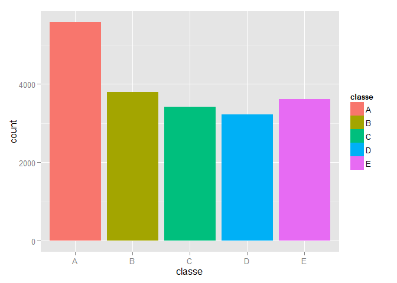
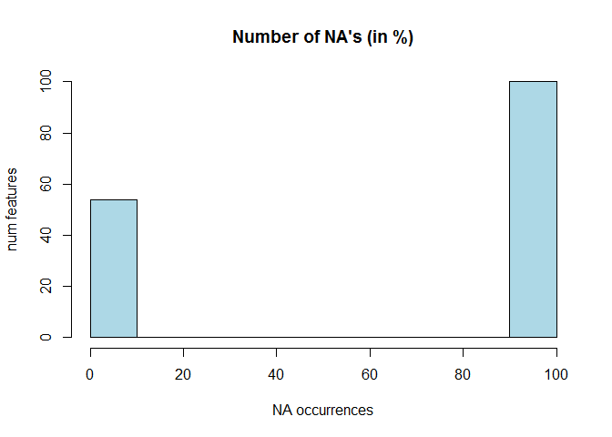
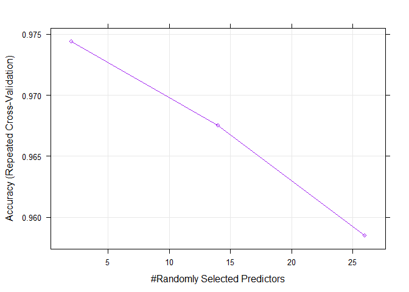

# Recognition of weight lifting exercises

# Executive summary
This report describes the process followed to build a prediction model that infers the way a weight lifting exercise is performed. The data used to train the model are gathered from six participants that are being monitored by a set of accelerometers while they perform a barbel lifting exercise in five different ways (one right and four common mistakes).

In order to make this research fully reproducible, it contains the complete R-code necessary to get the data sets (which are available online), explore them, clean and prepare the data sets, build the model and use it to predict the outcome for 20 instances. The final model is a random forest predictor which obtains a very good out of sample accuracy (around 98%). The predictor is robust, trained using k-fold cross validation, which balances bias and variance trade-offs using the out of sample accuracy as a metric to choose the best model.

# Getting the data
The following chunk of code prepares the work space, fetches the data sets and loads them in the environment:

```r
library(caret)
```

```
## Warning: package 'caret' was built under R version 3.1.1
```

```
## Loading required package: lattice
## Loading required package: ggplot2
```

```
## Warning: package 'ggplot2' was built under R version 3.1.1
```

```r
library(ggplot2)
rm(list=ls())
dataUrl <- "https://d396qusza40orc.cloudfront.net/predmachlearn/pml-training.csv"
validationUrl <- "https://d396qusza40orc.cloudfront.net/predmachlearn/pml-testing.csv"
dataFile <- "pml-training.csv"
validationFile <- "pml-testing.csv"
# download.file(dataUrl, dataFile, method='auto')
# download.file(validationUrl, validationFile, method='auto')
dataSet <- read.csv(dataFile, na.strings=c("NA", ""))
validationSet <- read.csv(validationFile, na.strings=c("NA", ""))
numInstances <- dim(dataSet)[1]; numFeatures <- dim(dataSet)[2]
dim(validationSet)
```

```
## [1]  20 160
```
With 160 features in each data set apart from the type of exercise and 19622 instances in the training set. 

# Exploratory analysis
Taking a first look a the data we can see some of the (a priori) most representative features:

```r
dataSet[1:5, c('user_name', 'classe', 'num_window', 'roll_belt', 'pitch_belt', 'yaw_belt')]
```

```
##   user_name classe num_window roll_belt pitch_belt yaw_belt
## 1  carlitos      A         11      1.41       8.07    -94.4
## 2  carlitos      A         11      1.41       8.07    -94.4
## 3  carlitos      A         11      1.42       8.07    -94.4
## 4  carlitos      A         12      1.48       8.05    -94.4
## 5  carlitos      A         12      1.48       8.07    -94.4
```
The following figure shows the class distribution for the data set:

```r
qplot(classe, fill=classe, data=dataSet)
```

 
It can be seen that not all classes are equally sampled. It would be desirable to preserve the class distribution when splitting the data set into training and testing sets.
Besides, the first five features are not interesting for prediction, apart from (maybe) the user name. Those features are:

```r
names(dataSet)[c(1:5)[-2]]
```

```
## [1] "X"                    "raw_timestamp_part_1" "raw_timestamp_part_2"
## [4] "cvtd_timestamp"
```

# Cleaning data

The following code gets rid of non interesting features and cast the rest of them as numeric values. Factor variables, such as the user name, are also converted to numeric:


```r
# convert interesting features to numeric values
dataSetNum <- dataSet[, c(2, 7:159)] # 2: user name
validationSetNum <- validationSet[, c(2, 7:159)]
# Store class in a separate variable for simplicity
y <- dataSet$classe

dataSetNum <- data.frame(sapply(dataSetNum, as.numeric))
validationSetNum <- data.frame(sapply(validationSetNum, as.numeric))
```

The data set contains a huge percent of NA values:


```r
mean(is.na(dataSetNum))
```

```
## [1] 0.6359
```

```r
hist(100*colMeans(is.na(dataSetNum)), col='lightblue', xlab='NA occurrences', ylab='num features', main = "Number of NA's (in %)")
```

 
Analyzing the NA distribution it can be seen that there are only two cases: those features which contain no NA's, and those that do. In the seconds case, when there are NA's in the data, they are present in almost the 100% of the instances. We could remove those features since they are not going to be useful for prediction:


```r
completeFeatures <- complete.cases(t(dataSetNum))
dataSetNum <- dataSetNum[, completeFeatures]
validationSetNum <- validationSetNum[, completeFeatures]
```
This could also be done using the `nearZeroVar()` function, but in this case it was pretty clear which features would have zero variance. 


# Data partitioning

```r
# Split training set into training and testing to build our predictor
set.seed(3232)
inTrain <- createDataPartition(y=y, p=0.75, list=FALSE)
training <- dataSetNum[inTrain, ]
testing <- dataSetNum[-inTrain, ]
dim(training)
```

```
## [1] 14718    54
```

```r
dim(testing)
```

```
## [1] 4904   54
```

Besides, we could also remove those features which present a high correlation in the training set, since they are not going to provide useful information:


```r
# remove highly correlated features
corIdx <- findCorrelation(cor(training))
training <- training[, -corIdx]
testing <- testing[, -corIdx]
validation <- validationSetNum[, -corIdx]
```

To refine a bit more the number of features used for the model training, we run a principal components analysis on the training data set. From the new set of features we keep only those that explain a 95% of the variability:


```r
# use PCA to get rid of some features
# keep only those that explain the 95% of the variability
modPca <- preProcess(training, method = 'pca', threshold = 0.95)
trainingPca <- predict(modPca, training)
testingPca <- predict(modPca, testing)
validationPca <- predict(modPca, validation)

# add the class to the features datasets
trainingPca$classe <- y[inTrain]
testingPca$classe <- y[-inTrain]
```
 Finally the class is added back from the original data set.


# Model training
The model selected is a random forest predictor. The training process uses k-fold cross validation in order to avoid over fitting the training data. Not using all the available training data for building the model is going to increase the predictor bias, but on the other hand it has provided better out of sample errors during the tests. The model is trained according to the following code:


```r
set.seed(32335)
fitControl <- trainControl(# 5-fold CV
    method = "repeatedcv", 
    number = 5,
    # repeated 5 times
    repeats = 5)
modFit <- train(classe ~., 
                method='rf', 
                trControl = fitControl, 
                data = trainingPca)
```

```
## Loading required package: randomForest
```

```
## Warning: package 'randomForest' was built under R version 3.1.1
```

```
## randomForest 4.6-10
## Type rfNews() to see new features/changes/bug fixes.
```

The convergence of the training process is shown in the following figure:


```r
# plotting the resampling profile
trellis.par.set(caretTheme())
plot(modFit, col='purple', lw=1)
```

 


## Validation
In order to validate the model, it is used to predict the classes for the training and testing data sets:


```r
# in sample error
trainingPrediction <- predict(modFit, trainingPca)
confusionMatrix(trainingPca$classe, trainingPrediction)
```

```
## Confusion Matrix and Statistics
## 
##           Reference
## Prediction    A    B    C    D    E
##          A 4185    0    0    0    0
##          B    0 2848    0    0    0
##          C    0    0 2567    0    0
##          D    0    0    0 2412    0
##          E    0    0    0    0 2706
## 
## Overall Statistics
##                                 
##                Accuracy : 1     
##                  95% CI : (1, 1)
##     No Information Rate : 0.284 
##     P-Value [Acc > NIR] : <2e-16
##                                 
##                   Kappa : 1     
##  Mcnemar's Test P-Value : NA    
## 
## Statistics by Class:
## 
##                      Class: A Class: B Class: C Class: D Class: E
## Sensitivity             1.000    1.000    1.000    1.000    1.000
## Specificity             1.000    1.000    1.000    1.000    1.000
## Pos Pred Value          1.000    1.000    1.000    1.000    1.000
## Neg Pred Value          1.000    1.000    1.000    1.000    1.000
## Prevalence              0.284    0.194    0.174    0.164    0.184
## Detection Rate          0.284    0.194    0.174    0.164    0.184
## Detection Prevalence    0.284    0.194    0.174    0.164    0.184
## Balanced Accuracy       1.000    1.000    1.000    1.000    1.000
```

```r
# out of sample error
testingPrediction <- predict(modFit, testingPca)
confusionMatrix(testingPca$classe, testingPrediction)
```

```
## Confusion Matrix and Statistics
## 
##           Reference
## Prediction    A    B    C    D    E
##          A 1385    2    3    4    1
##          B   19  916   14    0    0
##          C    3   15  833    3    1
##          D    1    2   37  761    3
##          E    0    4    0    6  891
## 
## Overall Statistics
##                                        
##                Accuracy : 0.976        
##                  95% CI : (0.971, 0.98)
##     No Information Rate : 0.287        
##     P-Value [Acc > NIR] : < 2e-16      
##                                        
##                   Kappa : 0.97         
##  Mcnemar's Test P-Value : 6.02e-08     
## 
## Statistics by Class:
## 
##                      Class: A Class: B Class: C Class: D Class: E
## Sensitivity             0.984    0.976    0.939    0.983    0.994
## Specificity             0.997    0.992    0.995    0.990    0.998
## Pos Pred Value          0.993    0.965    0.974    0.947    0.989
## Neg Pred Value          0.993    0.994    0.987    0.997    0.999
## Prevalence              0.287    0.191    0.181    0.158    0.183
## Detection Rate          0.282    0.187    0.170    0.155    0.182
## Detection Prevalence    0.284    0.194    0.174    0.164    0.184
## Balanced Accuracy       0.990    0.984    0.967    0.986    0.996
```

It can be seen that the out of sample error is quite good, reaching an accuracy around the 98%.


# Predictions
Finally the trained model is used to predict the classes for the unlabeled data set. The obtained predictions are stored in separate files as required:


```r
# Predict validation set
prediction <- predict(modFit, validationPca)
# save results in the submission format
pml_write_files = function(x) {
    n = length(x)
    for (i in 1:n) {
        filename = paste0("problem_id_", i, ".txt")
        write.table(x[i], file = filename, quote = FALSE, row.names = FALSE, 
                    col.names = FALSE)
        }
    }
pml_write_files(prediction)
```
